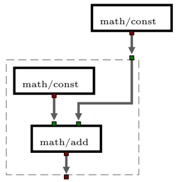

# Buggy graphtools [](https://travis-ci.org/BuggyOrg/graphtools) [](https://coveralls.io/github/BuggyOrg/graphtools?branch=master)

This package contains the graph API for Buggy graphs.

# Graph structure

A graph in Buggy is a directed, multigraph that allows compounds. Compounds are
subgraphs in a node of the graph itself. You can picture it like this:



Each node in the graph also has to have at least one port. Ports
are divided into input (green) and output ports (red). The format
for a graph is JSON which contains five basic fields:

```json
{
  "nodes": [
    {"ref": "<meta-id>", "id": "<some-unique-id>"},
    {"id": "<u-id>", "version": "<semver-version>", "componentId": "<component-id>",
     "ports": [{"port": "<port-name>", "kind": "input|output", "type": "number"}],
     "atomic": "true", "metaInformation": {"some-key": "some-value"}},
    {"id": "<u-id>", "version": "<semver-version>", "atomic": false,
     "ports": [{"port": "<port-name>", "kind": "input|output", "type": "number"}],
     "nodes": <Sub-Nodes>, "edges": <Sub-Edges>, "metaInformation": {"some-key": "some-value"}},
  ],
  "edges": [
    {"from": "<node-id>:<port-name>", "to": "<node-id>:<port-name>", "layer": "dataflow"}
  ],
  "version": "<semver-version of graph API>",
  "components": [
    {"componentId": "<component-id>", "ports": [...], "atomic": true},
    {"componentId": "<component-id>", "ports": [...], "nodes": <Sub-Nodes>, "edges": <Sub-Edges>}
  ],
  "metaInformation": {"some-key": "some-value"}
}
```

# Usage

```
import * as Graph from '@buggorg/graphtools'

Graph.nodes(graph)
Graph.Node.id(graph)
```

## Locations

A key concept in the graphtools are locations. Instead of walking through the graph there is a handy short notation to access most of the important graph elements. Most of the API functions that query something use locations at their core. If a function accepts a location it accepts a range of inputs.

### Node locations

If you query a specific node you can use one of the following:

 - The ID of the node (as a string (prefixed) with `"#"` or as `{id: "#..."}`). E.g. `Graph.node('#123abc', graph)`.
 - The name of the node like in `Graph.node('node-name', graph)`. But keep in mind that names are not unique throughout a graph.
 - A componentId prefixed with `"/"`. This can be used to query the first node that is of this kind like in `Graph.node('/math/add`, graph)`. A probably more interesting use case would be `Graph.nodesBy('/math/add', graph)' which returns all nodes in the root level of the graph that are a `math/add` component.
 - The node itself. It is always okay to do `Graph.node(Graph.node('#id...', graph), graph)`. This is usually interesting after updating a node in a graph, like in `Graph.setNodeMetaKey('key', 'value', nodeObj, graph)` where the `nodeObj` is the node you were working on.
 - A port of the node can be used as a node location. This is especially useful when working with edges. It is possible to do this: `Graph.node(edge.from, graph)` even though an edge mit start in a port. If the edge starts in a port `edge.from` will be a port object. But nevertheless it will accept this as a node location.

### Port Locations

In some functions it is interesting to specify a port explicitly. Usually when looking for predecessors or successors. A port location can be:

 - The port object itself like in: `Graph.successors(edge.from, graph)` or `Graph.successor(Node.port('output', nobeObj), graph)`.
 - The short notation like `Graph.successor('#node-id@out-port', graph)`. (This is not yet implemented / tested).
 
Keep in mind that functions like `Graph.successors` or `Graph.incidents` also take node locations as their input. In those cases they use all ports of the node to find the successors, incidents etc.

## JSDoc

You can find the JSDoc documentation [here](https://buggyorg.github.io/graphtools/index.html)
